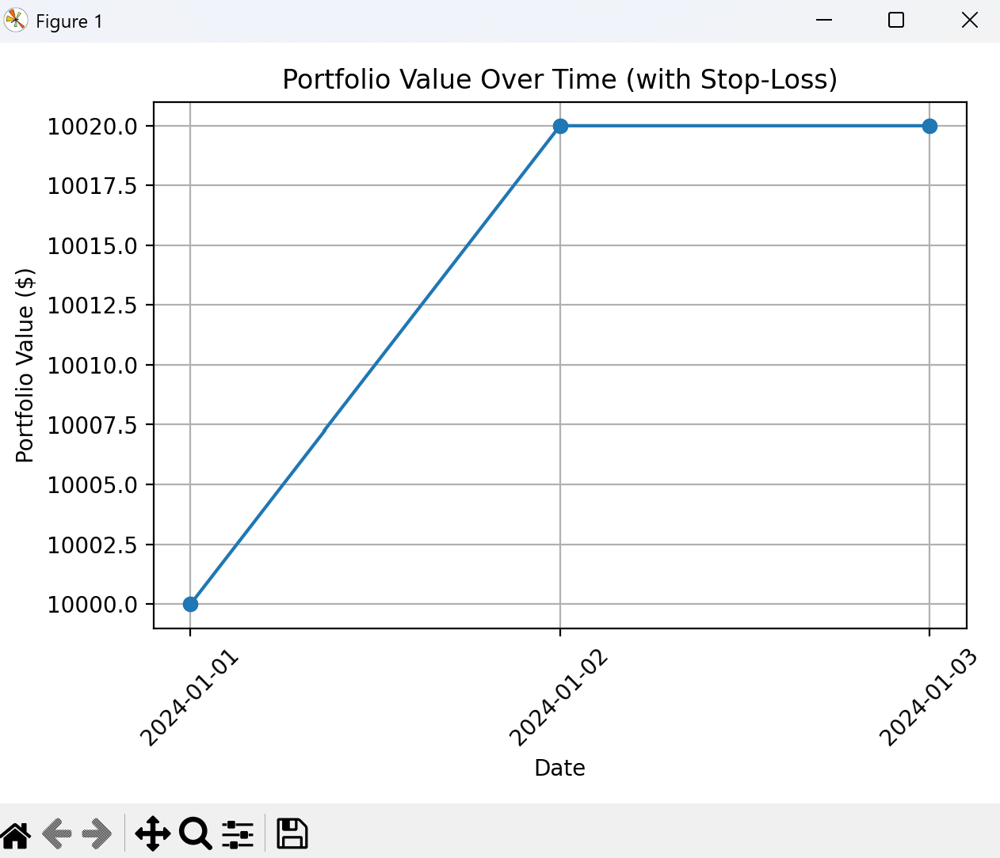

# Week 2 Finance Project: Multi-Stock Trading Simulator

## Project Overview
This project simulates trading multiple stocks using historical data.  
It calculates daily returns, executes buy/sell decisions, implements stop-loss logic, tracks portfolio value over time, and visualizes performance using Python, pandas, and matplotlib.

This project demonstrates beginner-to-intermediate skills in:

- Data handling and cleaning with **pandas**  
- Trading logic and portfolio simulation  
- Data visualization with **matplotlib**  
- Risk management using **stop-loss**  
- Clean GitHub repo and project organization  

---

## Folder Structure
Week2-Finance/
├── data/
│ ├── sample_stock.csv
│ └── multi_stock.csv
├── scripts/
│ ├── stock_analyzer.py
│ ├── multi_stock_analyzer.py
│ └── multi_stock_trading.py
├── images/
│ └── portfolio_plot.png
└── README.md


---

## Requirements

- **Python 3.14+**  
- **pandas**  
- **matplotlib**

Install required packages:

```bash
py -m pip install pandas matplotlib

How to Run
1️⃣ Single Stock Analysis
python scripts/stock_analyzer.py


Reads data/sample_stock.csv

Prints summary statistics (average, best, worst day)

2️⃣ Multi-Stock Analysis
python scripts/multi_stock_analyzer.py


Reads data/multi_stock.csv

Prints summary statistics per stock

Plots closing prices of all stocks

3️⃣ Multi-Stock Trading Simulation
python scripts/multi_stock_trading.py

Simulates buying/selling per stock based on daily returns

Implements stop-loss logic

Tracks cash and shares held per stock

Visualizes portfolio value over time

Features

Daily return calculations

Buy/Sell thresholds:

Buy 10 shares if daily return > 2%

Sell 5 shares if daily return < 1%

Stop-loss:

Sell all shares if daily return < -3%

Portfolio tracking:

Cash + stock holdings updated after each trade

Total portfolio value plotted over time

Data visualization:

Line charts for stock prices and portfolio value

Example Output

Console log:

Trading Log with Stop-Loss:
---------------------------
2024-01-02 AAPL: Bought 10 shares at 157
2024-01-02 GOOGL: Bought 10 shares at 2850
2024-01-03 AAPL: Sold 5 shares at 159
2024-01-03 GOOGL: Stop-loss triggered, sold 10 shares at 2830

Final Portfolio:
Cash: $9000.00
AAPL: 5 shares
GOOGL: 0 shares
Total Portfolio Value: $9950.00

Portfolio Value Chart:

# Portfolio Analysis

Here is the plot showing the portfolio value over time:

<p align="center">
  
</p>

**Figure 1:** Portfolio value over time


Notes

This project is designed for learning and demonstration purposes

It does not account for trading fees, slippage, or real market conditions

Can be extended to include multiple strategies, risk metrics, or live data feeds

Author

Vinh Vu

Python, pandas, matplotlib, Git/GitHub

Beginner/intermediate finance/trading projects

Portfolio-ready for employers

